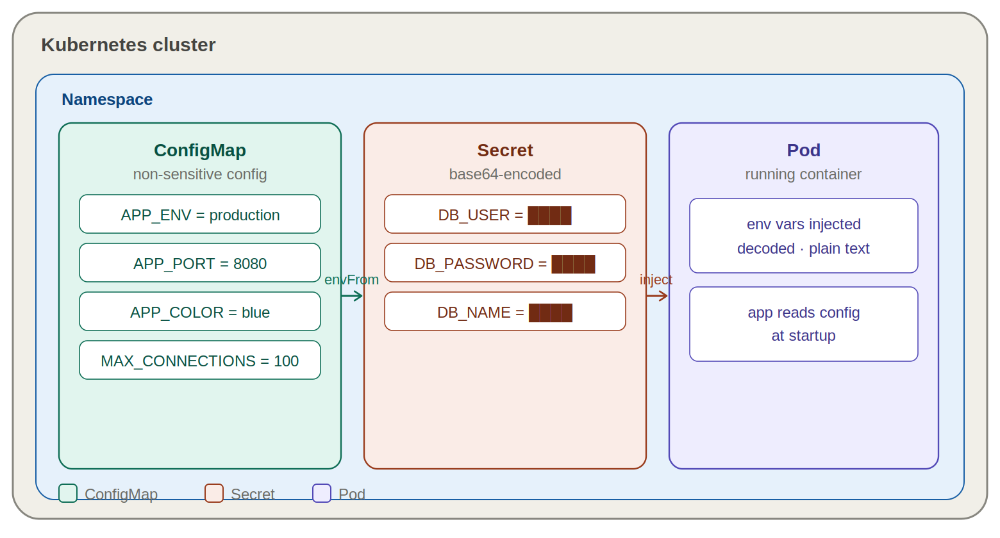
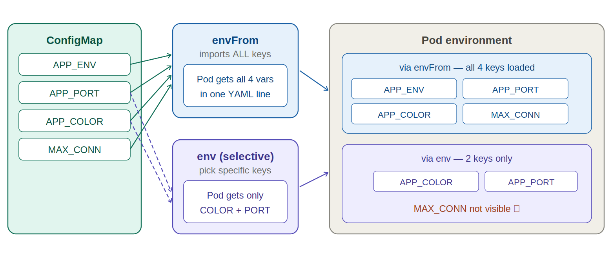
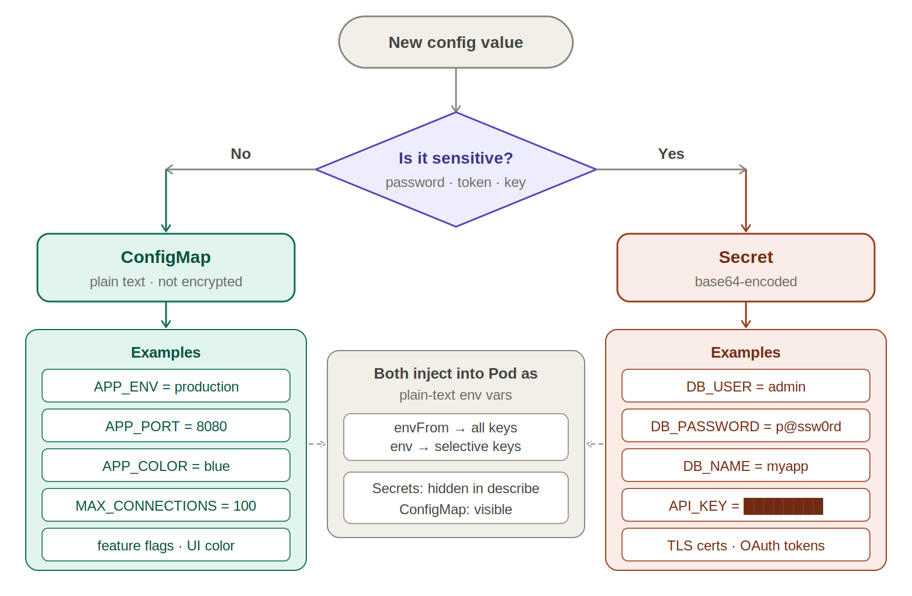

# K8s Assignment 5 — ConfigMaps & Secrets

> **Repo:** `galal21Mohamed/K8s_Assignment_5`
> **Topic:** Managing application configuration and sensitive data in Kubernetes using ConfigMaps and Secrets.

---

## Diagram 1 — Cluster Structure

> How ConfigMap & Secret live in the namespace and inject into the Pod



---

## Diagram 2 — Injection Methods: `envFrom` vs `env`

> `envFrom` pulls all keys at once — `env` lets you pick specific ones (why `MAX_CONNECTIONS` was invisible in Q3)



---

## Diagram 3 — Decision Flowchart

> One question decides everything: is the value sensitive?



---

## Q&A

### Q1 — What is the difference between a ConfigMap and a hardcoded variable?

| | Hardcoded | ConfigMap |
|---|---|---|
| Location | Inside the Pod manifest | External Kubernetes object |
| Updates | Requires redeployment | Updated independently |
| Reuse | Not reusable | Shared across multiple Pods |

**Answer:** Hardcoded variables are written directly into the Pod manifest, so any change requires redeploying the Pod. A ConfigMap stores configuration outside the Pod and can be easily updated or reused across multiple workloads without touching the manifest.

---

### Q2 — What did you see from `grep APP`? Difference between `envFrom` and `env` keys?

**grep APP result:** The environment variables created imperatively were injected into the Pod and visible in the output.

| Method | Behavior | Use when |
|---|---|---|
| `envFrom` | Imports **all** key-value pairs from a ConfigMap at once | You need the full config |
| `env` | Maps variables **one by one** individually | You need specific keys only |

---

### Q3 — Is `MAX_CONNECTIONS` visible? Why not?

**No.** Selective injection was used — only the `COLOR` and `PORT` keys were explicitly referenced from the ConfigMap. `MAX_CONNECTIONS` was never mapped.

**When to use selective injection instead of `envFrom`:** When you only need one or a few specific key-value pairs, not the entire ConfigMap. This keeps each Pod's environment minimal and avoids exposing unnecessary configuration.

---

### Q4 — How are values stored in a Secret YAML? Why is Base64 NOT encryption?

**Storage format:** Values are stored as Base64-encoded strings.

```yaml
apiVersion: v1
kind: Secret
data:
  DB_USER: YWRtaW4=              # base64("admin")
  DB_PASSWORD: cEBzc3cwcmQxMjM=  # base64("p@ssw0rd123")
  DB_NAME: bXlhcHA=              # base64("myapp")
```

**Why Base64 is not encryption:**
Base64 is an **encoding** scheme — it changes how data is *represented*, not how it is *protected*. Anyone can decode it trivially with `base64 --decode`. Real protection comes from Kubernetes RBAC, encryption at rest, and external secret managers (e.g. HashiCorp Vault, AWS Secrets Manager).

---

### Q5 — Are values decoded in logs? Visible in `kubectl describe pod`?

| Location | Visible? | Details |
|---|---|---|
| Container logs | ✅ Yes | Kubernetes decodes automatically at injection |
| `kubectl describe pod` | ❌ No | Secret values are redacted to prevent accidental leaks |

---

### Q6 — What variables were configured? How to decide what goes where?

#### ConfigMap — non-sensitive config

```
APP_ENV=production
APP_PORT=8080
APP_COLOR=blue
MAX_CONNECTIONS=100
```

#### Secret — sensitive data

```
DB_USER=admin
DB_PASSWORD=p@ssw0rd123
DB_NAME=myapp
```

| Goes in ConfigMap | Goes in Secret |
|---|---|
| App mode / environment | Passwords |
| Port numbers | API keys & tokens |
| Feature flags | Database credentials |
| Connection limits | TLS certificates |
| UI color / theming | OAuth secrets |

---

### Q7 — Did both Pods have the same vars? Advantage over hardcoding?

**Yes.** All Pods created by a Deployment share identical environment variables because they all use the same Pod template, which references the same ConfigMap and Secret.

| Benefit | Details |
|---|---|
| **Separation of concerns** | Config lives outside the application manifest |
| **Easy updates** | Change config without redeploying the app |
| **Security** | Sensitive data stays out of plain YAML definitions |
| **Consistency** | All replicas receive identical values automatically |

---

## Summary

| Feature | ConfigMap | Secret |
|---|---|---|
| Use case | Non-sensitive config | Sensitive data |
| Storage format | Plain text | Base64-encoded |
| Inject all keys | `envFrom` | `envFrom` |
| Inject specific keys | `env` (selective) | `env` (selective) |
| Visible in `kubectl describe` | ✅ Yes | ❌ No |
| Visible in container logs | ✅ Yes | ✅ Yes (decoded) |

---

*Assignment 5 — Kubernetes Configuration Management*
